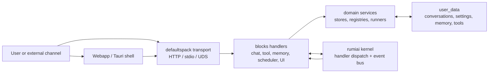
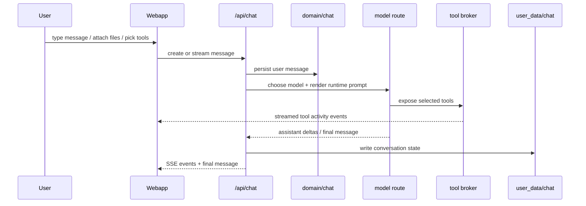
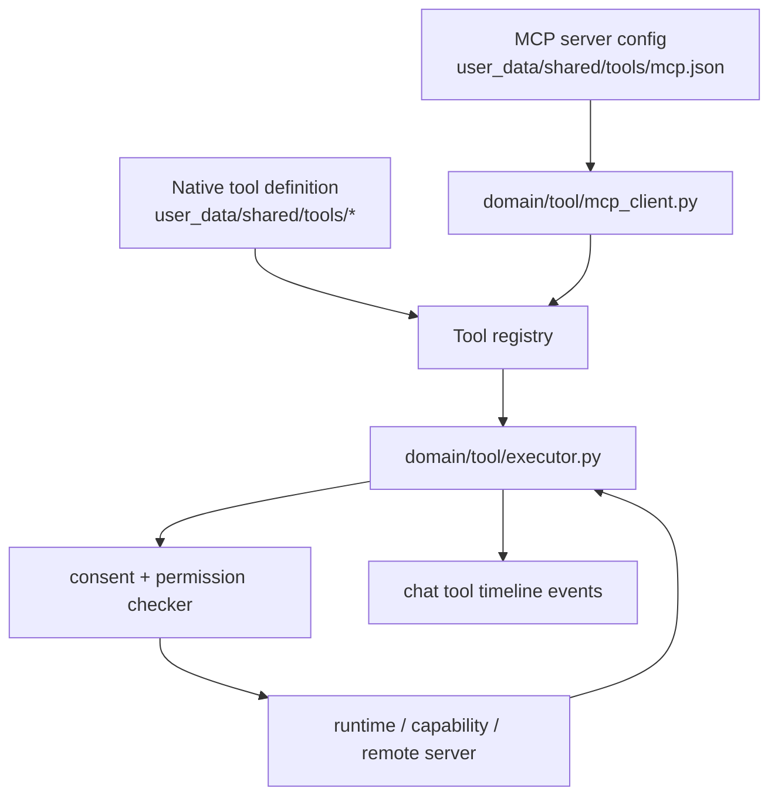
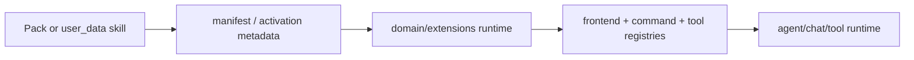
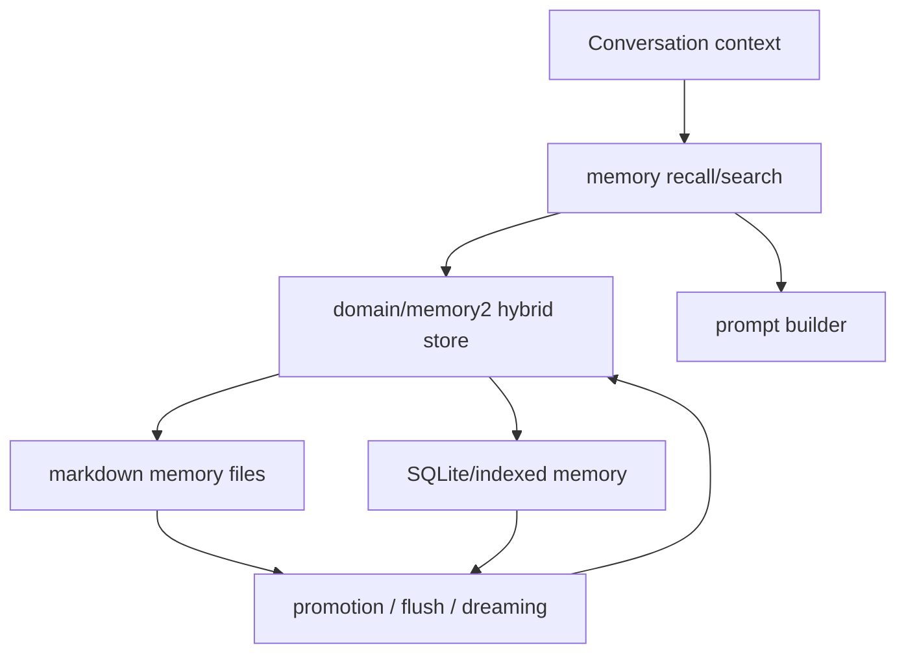
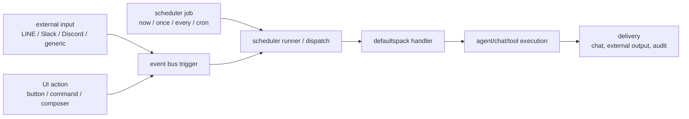

# defaultspack Explained

This document is the PR97 orientation map for defaultspack. It explains how the
local-first UI, chat runtime, tools, MCP, rules, skills, memory, scheduler, and
trigger surfaces fit together without requiring the kernel to know any
domain-specific behavior.

## Terminology

- `rule` means the always-on instruction layer that applies within a scope.
- `skill` means a trigger-based or on-demand bundle of instructions and workflow
  guidance.
- `prompt` means either a source asset or the rendered model text assembled for
  a run.
- `system prompt` is the lower-level API/runtime term for the system-role slice
  of that rendered prompt.
- `delegation` is the canonical action for sending work to another agent.
  `subagent` may still appear in compatibility fields or older docs, but it is
  not the preferred architecture term.

## Big Picture

defaultspack is the standard "AI service" pack for rumiai. The kernel provides
pack loading, handler dispatch, events, and transport primitives; defaultspack
provides the concrete chat, tool, memory, scheduler, and frontend behavior that
users experience.

The important boundary is that content remains removable. defaultspack supplies
the infrastructure and defaults; user_data and other packs can replace UI
assets, rules, prompt assets, tools, agents, schedules, memory files, and skill
definitions.

## UI And Chat Flow

The standalone webapp in `webapp/` talks to `/api/...` endpoints exposed by
defaultspack. The UI renders a shell with history, chat messages, composer,
activity preview, right sidebar, settings, and optional coding cockpit regions.

The Tauri shell uses the operating system's decorated window, localized as
`Tobkiri`. Native chrome owns dragging, double-click maximize/restore, window
state synchronization, keyboard focus, and the platform-standard minimize,
maximize, restore, and close controls. The web title bar is rendered only in a
standalone browser and must not add window-control handlers or interactive
descendants. This keeps presentation code from acquiring window authority and
prevents web pointer events from conflicting with native window behavior.

Chat messages are not just text. They can carry content blocks, widgets, tool
logs, browser screenshots, and activity events. The renderer decides how much
of that structured data to surface in the message timeline and the activity
preview pane.

## Tool And MCP Flow

Native tools and MCP tools converge behind the same tool registry and execution
contract. The model sees a unified catalog; the executor decides whether a tool
is local, capability-backed, HTTP-backed, or MCP-backed.

MCP integration is intentionally transparent at call time. A tool such as
`mcp_fs_read_file` is invoked through the same `defaults.tool.invoke` path as a
native tool. Approval mode, permissions, and audit behavior stay attached to
the tool call rather than to the model that requested it.

### Evidence-Based Verification

PR97 checks should not treat assistant prose or fixed marker strings as proof.
The proof lives in structured runtime evidence that the model cannot fake by
typing similar text.

Assistant message text is never proof that a tool, MCP server, skill, trigger,
delegation, or dropped chat context actually ran. Treat prose such as "I used
the tool" as display text only; pass/fail decisions must read structured
records produced by the runtime or visible UI state observed by
Browser/Playwright.

| Claim | Evidence to check |
|---|---|
| MCP was usable by Rumi | assistant message `tool_logs`, `tool_call_started`, and `tool_call_completed` contain the MCP tool id and result |
| A skill fired | assistant metadata contains `matched_skill_instructions`, and the prepared system context contains the rendered skill instruction |
| A dropped chat was referenced | user metadata contains `chat_references.references[]` with `conversation_id`, summary, and `history_json_path` |
| A trigger fired without sending | external pipeline metadata has `fire=true` and `send=false` |
| UI preview opened | Playwright/Browser observes the actual foreground dialog or timeline item, not a mocked assistant sentence |

For deterministic tests, use dynamic input and assert that the final answer is
derived from the tool result. For live browser smoke tests, keep the pass/fail
condition on `tool_logs`, metadata, and visible UI state; the assistant text is
only a human-readable side effect.

API-only checks are allowed as diagnostics when a Browser/Playwright flow fails,
but they do not by themselves prove that the browser workflow works. UI contract
tests that mock `/api/...` should be named as mocked UI coverage and kept
separate from live MCP evidence tests, which must create any server, approval,
permission, and nonce state inside the test.

## Rules, Skills, And Extensions

Rules provide the always-on instruction layer. Skills provide targeted
instruction and workflow bundles that activate when relevant. defaultspack
treats both as extension content rather than hardcoded runtime knowledge.

The same extension path can add commands, panels, tool metadata, rules, prompt
assets, or agent capabilities. The UI receives those as catalog data and
renders them in the sidebar or composer without needing pack-specific code.

## Memory Flow

Memory is split between conversation state, long-lived user/project memory, and
searchable knowledge. Chat and agent runs can read memory when building context
and can write back durable facts after approval or policy checks.

The default local-first rule is that memory is stored under user-controlled
paths. Cloud vector stores or remote knowledge backends can be added later, but
they are optional providers and should be permission-gated.

## Scheduler And Trigger Flow

Schedulers and triggers are entrypoints into the same handler and event system
used by the UI. A trigger can come from a time schedule, an external webhook, a
frontend action, a P2P/company event, or another handler.

`no_agent` scheduler jobs are deliberately constrained. Agent jobs are the
normal path because they preserve conversation context, permissions, approval,
and audit records.

## Request Surfaces

| Surface | Example | Default path |
|---|---|---|
| UI chat | User sends a composer message | `/api/chat/conversations/{id}/stream` |
| UI action | Sidebar action previews a result | `/api/ui/catalog` plus action endpoint |
| Tool call | Model invokes a native or MCP tool | `defaults.tool.invoke` |
| MCP | Server exposes external tools | `domain/tool/mcp_client.py` |
| Rule | Always-on instruction layer is applied for a run | prompt assembly and runtime policy layers |
| Skill | Pack contributes workflow behavior | `domain/extensions/*` |
| Memory | Prompt builder recalls context | `domain/memory*` |
| Scheduler | Job fires on time or demand | `/api/agent/schedules` |
| Trigger | Webhook/event enters runtime | gateway, scheduler, or event bus |

## Operational Rules

- Keep the kernel generic; put AI-service domain behavior in defaultspack.
- Keep user data replaceable; defaults provide slots and contracts, not lock-in.
- Prefer local-first operation; remote providers are opt-in.
- Stream tool activity early; the UI should show what is happening before final
  chat text arrives.
- Treat scheduler, MCP, and external inputs as trigger surfaces that must pass
  through the same permission, consent, and audit model as user-initiated work.
